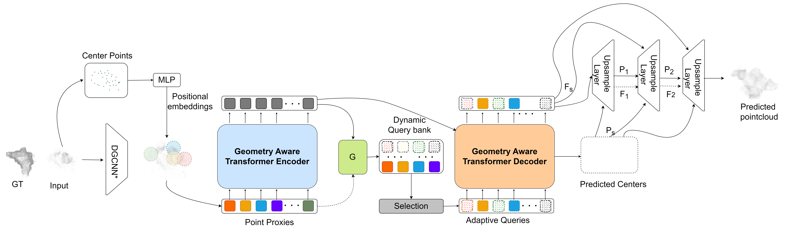

# UpPoinTr

This repo contains the code for UpPoinTr, based on AdaPoinTr and seedformer. 

UpPoinTr Architecture:




## Usage


### Requirements

```
conda env create -f UpPoinTr.yaml
```

or manually install

- PyTorch >= 1.7.0
- python >= 3.7
- CUDA >= 9.0
- GCC >= 4.9 
- torchvision
- timm
- open3d
- tensorboardX

```
pip install -r requirements.txt
```

#### Building Pytorch Extensions for Chamfer Distance, PointNet++ and kNN

*NOTE:* PyTorch >= 1.7 and GCC >= 4.9 are required.

```
# PointNet++
pip install "git+https://github.com/erikwijmans/Pointnet2_PyTorch.git#egg=pointnet2_ops&subdirectory=pointnet2_ops_lib"
# GPU kNN
pip install --upgrade https://github.com/unlimblue/KNN_CUDA/releases/download/0.2/KNN_CUDA-0.2-py3-none-any.whl
```

```
# Chamfer Distance
bash install.sh
```


### Dataset

The details of our new ***ColoRadar*** dataset can be found in [ColoRadarDATASET.md](./ColoRadarDATASET.md).

### Inference

To inference sample(s) with pretrained model

```
python tools/inference.py \
${UpPOINTR_CONFIG_FILE} ${UpPOINTR_CHECKPOINT_FILE} \
[--pc_root <path> or --pc <file>] \
[--save_vis_img] \
[--out_pc_root <dir>] \
```

For example, inference all samples under `demo/` and save the results under `inference_result/`
```
python tools/inference.py \
cfgs/PCN_models/AdaPoinTr.yaml ckpts/AdaPoinTr_PCN.pth \
--pc_root demo/ \ 
--save_vis_img  \
--out_pc_root inference_result/ \
```

### Evaluation

To evaluate a pre-trained PoinTr model on the Three Dataset with single GPU, run:

```
bash ./scripts/test.sh <GPU_IDS>  \
    --ckpts <path> \
    --config <config> \
    --exp_name <name> \
    [--mode <easy/median/hard>]
```

####  Some examples:
Test the UpPoinTr pretrained model on the ColoRadar dataset:
```
bash ./scripts/test.sh 0 \
    --ckpts ./pretrained/UpPoinTr.pth \
    --config ./cfgs/ColoRadar_models/UpPoinTr.yaml \
    --exp_name example
```

### Training

To train a point cloud completion model from scratch, run:

```
# Use DistributedDataParallel (DDP)
bash ./scripts/dist_train.sh <NUM_GPU> <port> \
    --config <config> \
    --exp_name <name> \
    [--resume] \
    [--start_ckpts <path>] \
    [--val_freq <int>]
# or just use DataParallel (DP)
bash ./scripts/train.sh <GPUIDS> \
    --config <config> \
    --exp_name <name> \
    [--resume] \
    [--start_ckpts <path>] \
    [--val_freq <int>]
```
####  Some examples:
Train  UpPoinTr model on ColoRadar benchmark with 2 gpus:
```
CUDA_VISIBLE_DEVICES=0,1 bash ./scripts/dist_train.sh 2 13232 \
    --config ./cfgs/ColoRadar_models/UpPoinTr.yaml \
    --exp_name example
```
Resume a checkpoint:
```
CUDA_VISIBLE_DEVICES=0,1 bash ./scripts/dist_train.sh 2 13232 \
    --config ./cfgs/ColoRadar_models/UpPoinTr.yaml \
    --exp_name example --resume
```


## License
MIT License

## Acknowledgements
Code to support UpPoinTr model and ColoRadar dataset has been added to the original [PoinTr](https://github.com/yuxumin/PoinTr/tree/master) github repo


## Citation
If you find our work useful in your research, please consider citing: 
```
@inproceedings{yu2021pointr,
  title={PoinTr: Diverse Point Cloud Completion with Geometry-Aware Transformers},
  author={Yu, Xumin and Rao, Yongming and Wang, Ziyi and Liu, Zuyan and Lu, Jiwen and Zhou, Jie},
  booktitle={ICCV},
  year={2021}
}
```
